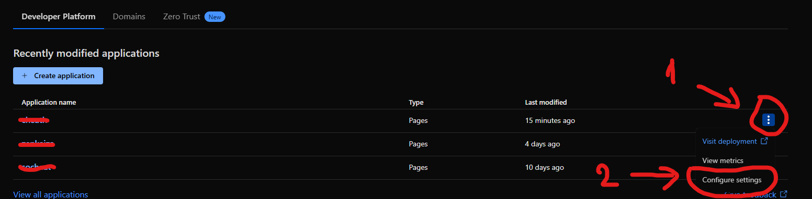
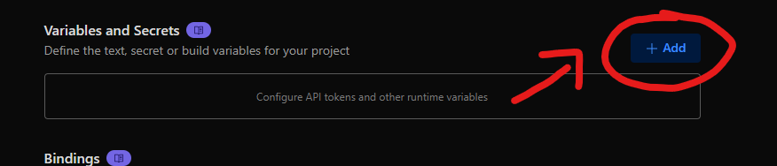
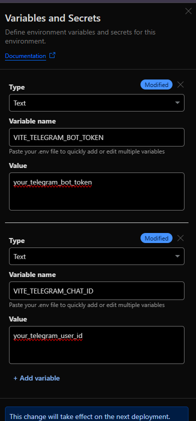

## Environment Variables for local

This project requires a `.env` file in the root directory to store sensitive configuration such as your Telegram Bot Token and Chat ID.  
**Do not commit your `.env` file to version control**—it is already included in `.gitignore` for security.

### Required Variables

Add the following to your `.env` file:

```
VITE_TELEGRAM_BOT_TOKEN=your_telegram_bot_token
VITE_TELEGRAM_CHAT_ID=your_telegram_chat_id
```

Replace the values with your actual Telegram bot token and chat ID.

> **Note:**  
> After editing your `.env` file, restart the development server to apply changes.


## Adding Your Profile Image

To display your profile image on the site, add your image file named `profile.jpg` to the following location in your project:

```
public/assets/profile.jpg
```

Make sure the image is named **exactly** `profile.jpg` and placed inside the `public/assets/` folder.  
This image will be used as your profile picture on the deployed site.

> **Note:**  
> If you add `profile.jpg` to `.gitignore`, it will not be uploaded to GitHub or included in deployments from your repository.  
> To display your profile image on your deployed site, ensure `profile.jpg` is present in your repository before


## Deploying to Cloudflare Pages

You can easily deploy this project to [Cloudflare Pages](https://pages.cloudflare.com/):

### 1. Connect Your Repository

- Go to [Cloudflare Pages](https://pages.cloudflare.com/) and log in.
- Click **Create a Project** and connect your GitHub repository.

### 2. Configure Build Settings

- **Framework preset:** Select `Vite`.
- **Build command:** `npm run build` (default)
- **Output directory:** `dist` (default)

### 3. Set Environment Variables

To use your Telegram bot integration, you must set the required environment variables in Cloudflare Pages:

- Go to your project’s **Account Home** > click on three dotted > **Configure settings**.

  

- Scroll down and find **Variables and Secrets** > click **+Add**

    

- Add the following variables:
  - `VITE_TELEGRAM_BOT_TOKEN`
  - `VITE_TELEGRAM_CHAT_ID`
- Use your actual Telegram bot token and chat ID as values > **Save**.

  


### 4. Deploy

- After setting up, Cloudflare Pages will automatically build and deploy your site.
- On future pushes to your repository, Cloudflare will redeploy automatically.

> **Note:**  
> The `.env` file is only needed for local development and should not be committed to your repository.  
> For production, always use Cloudflare’s environment variable settings.

For more details, see the [Cloudflare Pages documentation](https://developers.cloudflare.com/pages/).